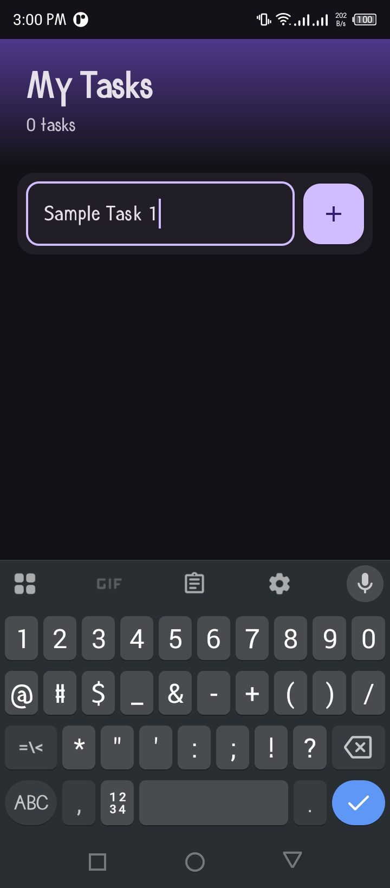
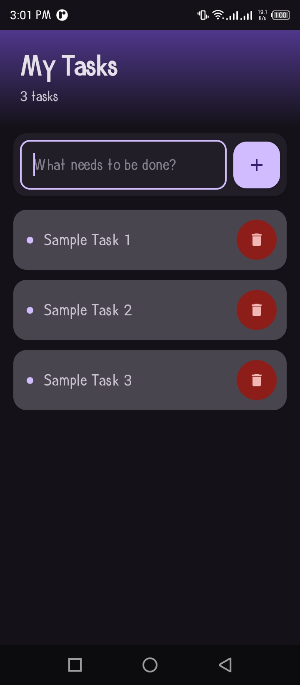
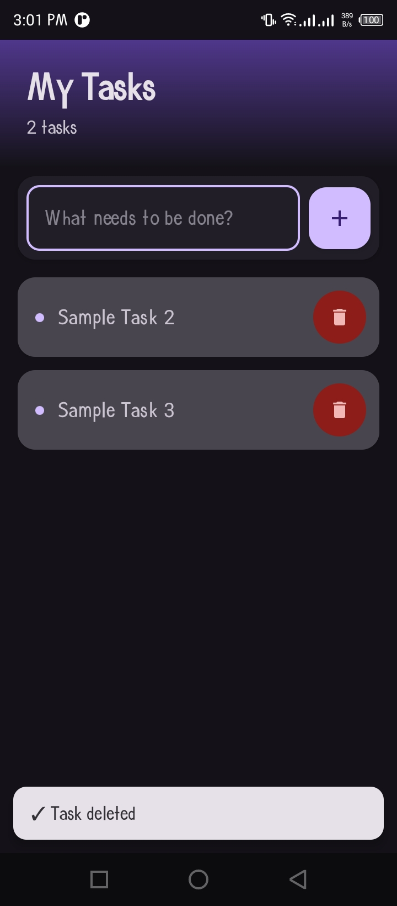

FRAMEWORK USED >>

Native Android with Kotlin & Jetpack Compose

- Language: Kotlin
- UI Framework: Jetpack Compose with Material Design 3
- Architecture: Modern Android development with declarative UI
- Min SDK: API 24 (Android 7.0)
- Target SDK: API 36

Why I Native Android instead of Flutter/React Native?

While the project initially aimed for a cross-platform solution, native Android was chosen due to practical constraints: Flutter requires a 1GB SDK download, and React Native involves complex setup with hundreds of dependencies and long build times. Native Android was already available in the development environment, offering superior performance, smaller app size (~5MB vs 15-25MB), and faster development with Jetpack Compose's modern declarative UI.

NATIVE VS CROSS-PLATFORM COMPARISON >>

Native Android (Implemented):
- Android-only applications
- Maximum performance requirements
- Smallest possible app size
- Immediate development without additional setup
- Latest Android features needed immediately

Flutter:
- Need iOS, Android, web, and desktop from single codebase
- Team comfortable learning Dart
- Consistent UI across all platforms
- Willing to download 1GB SDK

React Native:
- Team has strong JavaScript/React experience
- Need to share code with web application
- iOS and Android deployment required
- Larger app size acceptable

DESCRIPTION OF APP FEATURES >>

Core Functionality
- Add Tasks: Text input field with floating action button to add new tasks
- View Tasks: Scrollable list displaying all tasks in modern card design
- Delete Tasks: Remove tasks with a single tap on the delete button
- Task Counter: Dynamic counter showing total number of tasks in header
- Delete Notification: Snackbar popup confirming task deletion

User Interface & User Experience
- Modern Design: Material Design 3 with gradient header
- Smooth Animations: Spring bounce effects and scale animations on interactions
- Intuitive Interface: Clean, single-screen layout
- Mobile-Optimized: Responsive design for various screen sizes
- Dynamic Theming: Adaptive Material 3 color scheme
- Fast & Responsive: Instant feedback on all user interactions
- Visual Indicators: Color dots for each task item
- Clear Actions: Prominent delete buttons with visual feedback

SCREENSHOTS >>

  
  
  

